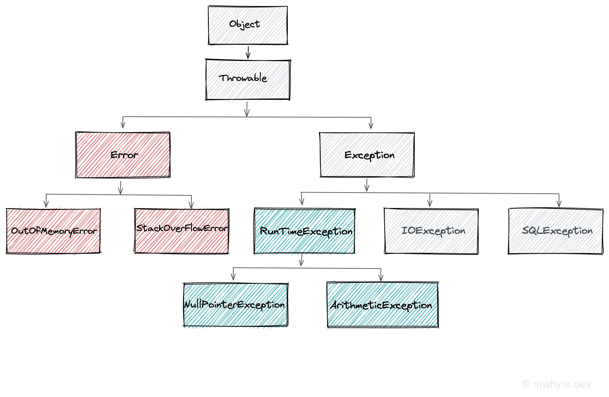

# java-exceptions

Intro / Agenda
What is an Exception?

Hierarchy:

Types of Exception
- error
- checked
- unchecked

Exception Handling
try
catch
finally
throw
understanding the stack trace
call stack explained

try with resources
creating custom exceptions
testing for exceptions

gist: https://gist.github.com/MWhyte/8c4dd1dbcf3a556d9cd777503bf5c521/edit
